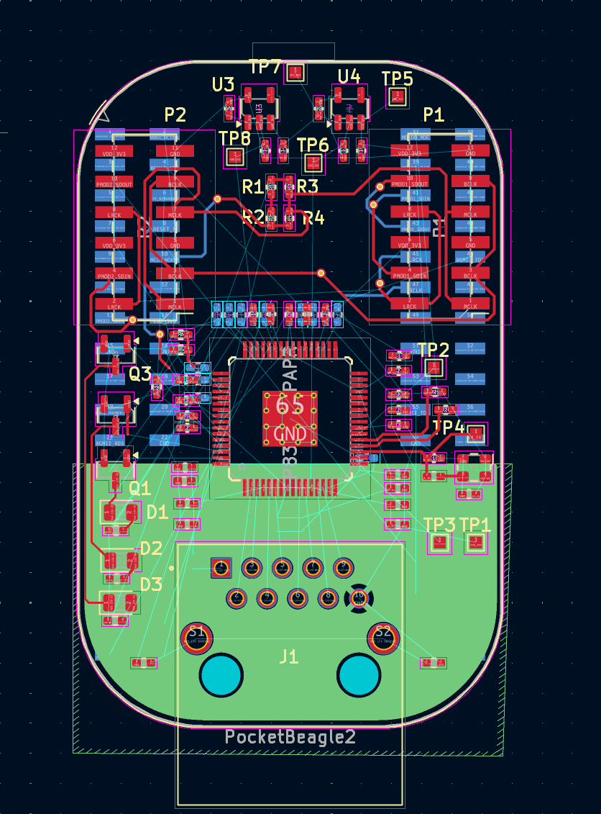
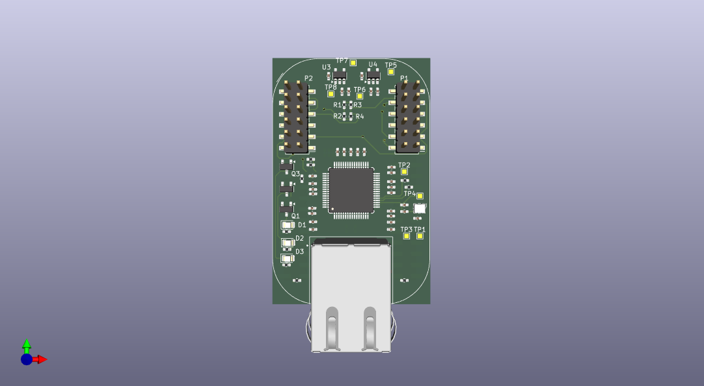
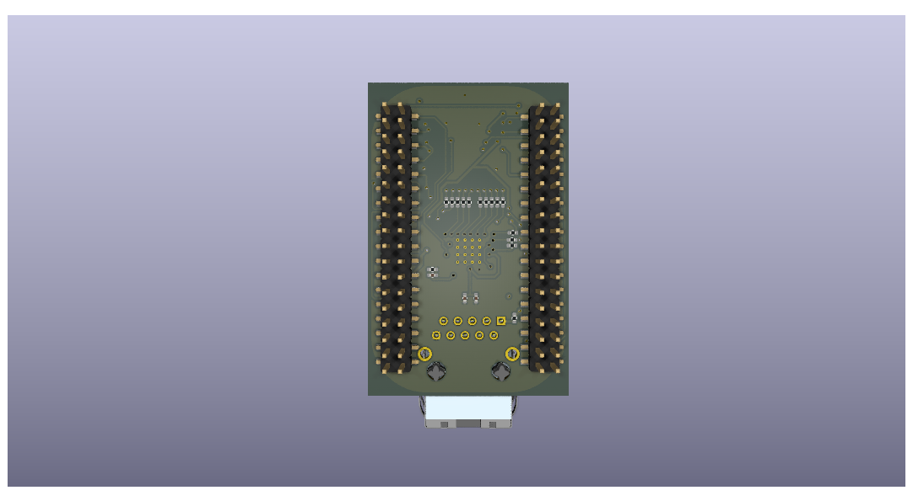

# PocketBeagle 2 Ethernet Cap

Ethernet cap for the PocketBeagle 2, exposing the TSN features of the AM62x through a
DP83867IRPAPR gigabit PHY (RGMII), plus an I2S audio PMOD interface.

## Getting started

```sh
git clone <this repo>
git submodule update --init     # pulls kebag_logic_kicad_library
```

Open `pocketbeagle2_ethernet_cap.kicad_pro` with KiCad ≥ 9. All symbols/footprints
resolve project-locally through `sym-lib-table` / `fp-lib-table` into the
[kebag_logic_kicad_library](https://github.com/kebag-logic/kebag_logic_kicad_library)
submodule — no global library setup needed.

## Schematic structure

```
pocketbeagle2_ethernet_cap.kicad_sch   root: U1 PocketBeagle 2 host module
├── network.kicad_sch                  network domain top
│   ├── phy.kicad_sch                  U2 DP83867 PHY, straps, decoupling, status LEDs
│   ├── rj45_connector_port0.kicad_sch J1 RJ45 magjack (integrated magnetics)
│   └── oscillator.kicad_sch           Y1 25 MHz HCMOS oscillator + clock conditioning
├── ldo_2v5.kicad_sch                  U4 TPS7A2025 -> VDD_2V5
├── ldo_1v1.kicad_sch                  U3 TPS7A2011 -> VDD_1V1
└── audio.kicad_sch                    P1/P2 PMOD I2S
```

## Documentation

- [documentation/connections.md](documentation/connections.md) — RGMII, MDI, MDIO,
  clocking, straps, audio, power tree, and the rev A → current net rename map
- [documentation/naming_convention.md](documentation/naming_convention.md) — mandatory
  signal naming rules
- [documentation/library_additions.md](documentation/library_additions.md) — every
  part added to the KL library for this design (review checkpoint)
- [documentation/U2-DP83867IRPAPR_pin_out.md](documentation/U2-DP83867IRPAPR_pin_out.md)
- [documentation/current_consumption.md](documentation/current_consumption.md)

## Board state

The **rev A** routed board (as manufactured) is preserved at git tag `revA-routed`
(flight-time matching on the RGMII still open there). The current schematic rework is
library/structure only — the `.kicad_pcb` is untouched and will be re-synced when
routing resumes.

Rev A pictures:




