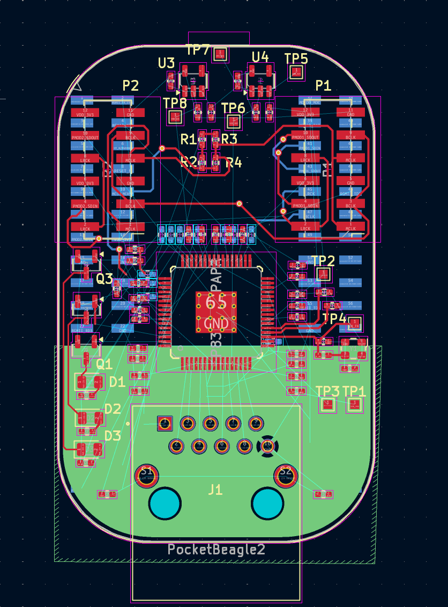
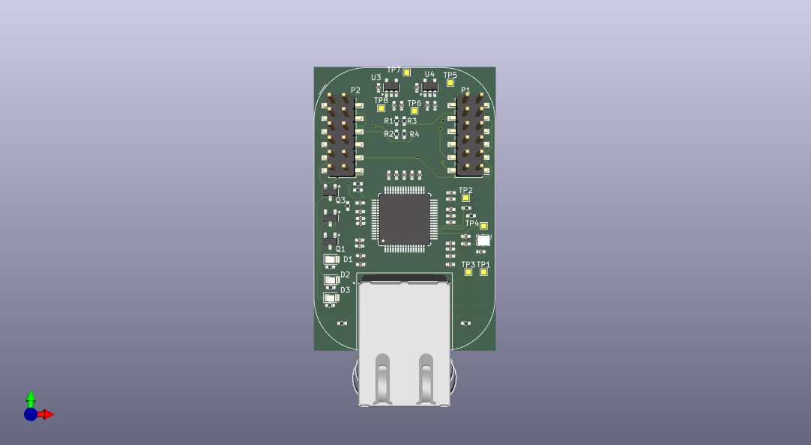
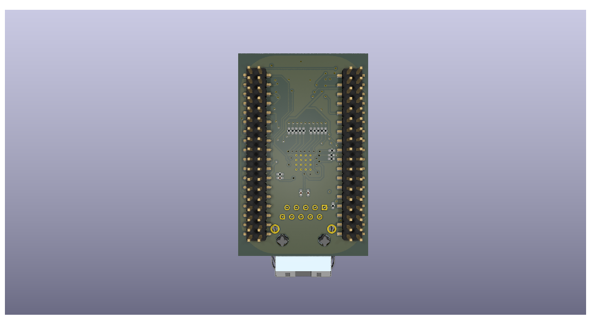
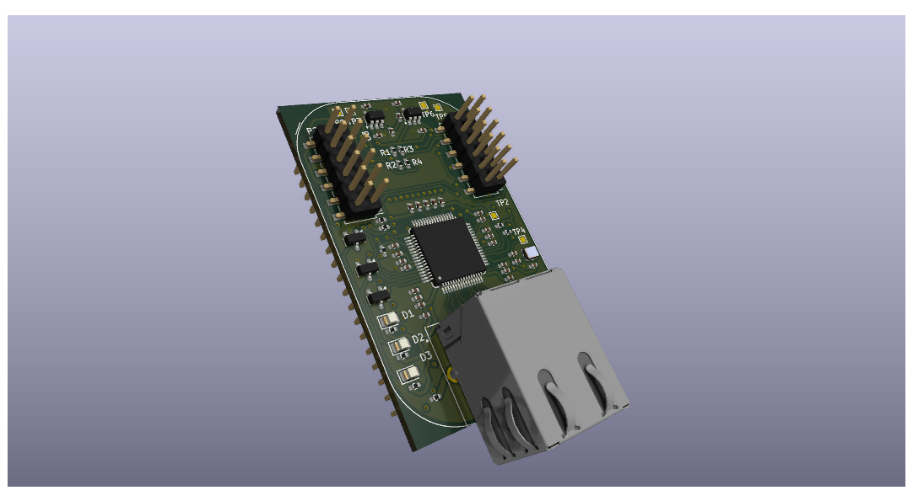

* BeaglePocket Ethernet Cap

The Ethernet cap to leverage the TSN features of the AM672.
Currenrly this the state of the ethernet cap.

PCB layout picture:

Front Picture:

Back picture:

Side:

